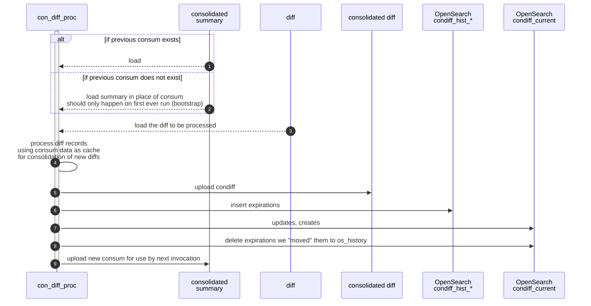
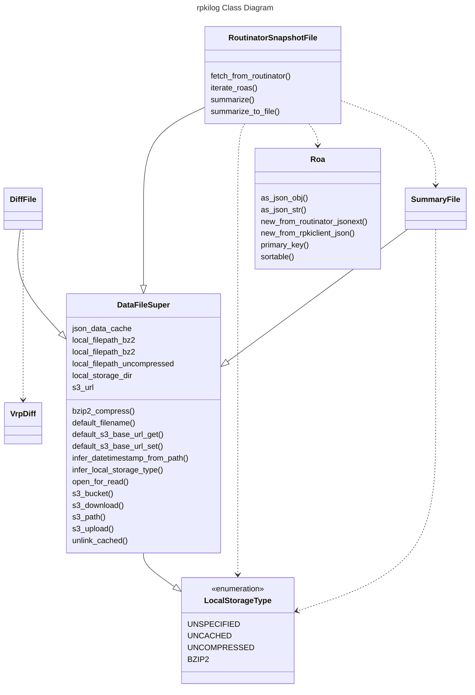

# Data source(s)

job suggests fetching https://console.rpki-client.org/vrps.json every 5m
and using that as a source of changes.  This makes sense later on.  In the
short term, I care more about past history; so I'll come back to this.

rpkiviews.org lists some archives including josephine.sobornost.net.

http://josephine.sobornost.net/josephine.sobornost.net/rpkidata/ has that
history in its tar files, e.g. rpki-dateTtimeZ/output/rpki-client.json
contains the same data schema as vrps.json:

```json
{
    "metadata": {
        "buildmachine": "josephine",
        "buildtime": "2021-11-21T00:07:00Z",
        ...
    },
    "roas": [
        { "asn": 13335, "prefix": "1.0.0.0/24", "maxLength": 24, "ta": "apnic", "expires": 1637590711 },
        { "asn": 38803, "prefix": "1.0.4.0/24", "maxLength": 24, "ta": "apnic", "expires": 1637584003 },
        ...
    ],
	"bgpsec_keys": [
		{ "asn": 15562, "ski": "5D4250E2D81D4448D8A29EFCE91D29FF075EC9E2", "pubkey": "MFkwEwYHKoZIzj0CAQYIKoZIzj0DAQcDQgAEgFcjQ/g//LAQerAH2Mpp+GucoDAGBbhIqD33wNPsXxnAGb+mtZ7XQrVO9DQ6UlAShtig5+QfEKpTtFgiqfiAFQ==", "ta": "ripe", "expires": 1668013479 },
		{ "asn": 15562, "ski": "BE889B55D0B737397D75C49F485B858FA98AD11F", "pubkey": "MFkwEwYHKoZIzj0CAQYIKoZIzj0DAQcDQgAE4FxJr0n2bux1uX1Evl+QWwZYvIadPjLuFX2mxqKuAGUhKnr7VLLDgrE++l9p5eH2kWTNVAN22FUU3db/RKpE2w==", "ta": "ripe", "expires": 1668013483 }
	]
}
```

# VRP Cache diffs we generate 

I'm generating what I think is appropriately named *VRP Cache diffs* in the
below JSON structure (abbreviated for brevity).  The output is easy to grep
as each *diff* is a single line.

```json
{
"object_type": "rpkilog_vrp_cache_diff_set",
"metadata": {
    "vrp_cache_old": {
        ... copy of metadata from old input file ...
    },
    "vrp_cache_new": {
        ... copy of metadata from new input file ...
    },
    ...
},
"vrp_diffs": [
    { "verb": "REPLACE", "old_roa": { "prefix": "192.0.2.0/24", "maxLength": 22, "asn": 64496, "expires": 1637509817, "ta": "test" }, "new_roa": { "prefix": "192.0.2.0/24", "maxLength": 24, "asn": 64496, "expires": 1637539219, "ta": "test" } },
]
}
```

# ElasticSearch records for changes

We need to be able to query shorter prefixes.  That's essential to finding out what ROAs could have
affected a given prefix.  I think this means we need to send queries for all shorter routes, like:

Something like this could work:
```json
{
    "asn": 64496, "prefix": "2001:db8::/32", "maxLength": 48, "ta": "test-rir", "expires": 12345
}
```

```json
# GET range_index/_search
{
    "query": {
        "prefix": {
            "addr": {
                "192.0.2.0/24"
            }
        },
        # or ?  how to express this in elasticsearch?
        "prefix": {
            "addr": {
                "192.0.2.0/23"
            }
        },
        # repeat until /0
        "prefix": {
            "addr": {
                "192.0.0.0/22"
            }
        }
        # should also constrain the maxLength for each of these
        # let's put some data into ES and experiment
    }
}
```

# VRP Diff Consolidation

## Overview

ROA management software is commonly issuing short-term ROAs and replacing them very frequently, extending
the expiration by just a few hours each time.  Two typical examples are below.

Because of this behavior, diffs are completely dominated by routine expiration extensions -- not substantive
modifications to ROAs.  We can consolidate these noisy expiration-extensions into a separate series of
database indices and improve the usability of the database / history.  The _old behavior_ can still be
retained and in fact, our GUI might make it easy to switch back and forth between result-sets.

### `8.8.8.0/24` observations

Google appears to maintain ROAs for `8.8.8.0/24` which expire between 24 and 58 hours in the future.
Often, two or three updates per day are seen for this prefix, observed at roughly 00:35, 10:35, or 14:35.
However, their updates skip a whole day and then resume at 00:35 the following day.

```json
{
    "observation_timestamp": "2023-10-11T14:34:52Z",
    "verb": "REPLACE",
    "prefix": "8.8.8.0/24",
    "maxLength": 24,
    "asn": 15169,
    "ta": "arin",
    "old_expires": "2023-10-12T14:00:00Z",
    "old_roa": {
      "asn": 15169,
      "expires": 1697119200,
      "maxLength": 24,
      "prefix": "8.8.8.0/24",
      "ta": "arin"
    },
    "new_expires": "2023-10-14T00:00:00Z",
    "new_roa": {
      "asn": 15169,
      "expires": 1697241600,
      "maxLength": 24,
      "prefix": "8.8.8.0/24",
      "ta": "arin"
    }
}
```

### `156.154.191.0/24` observations from ARIN-hosted service

In this example, the diff observed at 06:34:53Z replaces a ROA expiring in ~23.5 hours with one expiring
in ~31.5 hours.  It's likely there is a 34-minute delay between when these ROAs are issued and when they're
observed by our system.  Therefore, this ROA management software appears to have a goal of maintaining
ROAs with expiration time 24 to 32 hours in the future.  It will issue an update about three times daily.

```json
{
    "observation_timestamp": "2023-10-13T06:34:53Z",
    "verb": "REPLACE",
    "prefix": "156.154.191.0/24",
    "maxLength": 24,
    "asn": 397213,
    "ta": "arin",
    "old_expires": "2023-10-14T06:00:00Z",
    "old_roa": {
      "asn": 397213,
      "expires": 1697263200,
      "maxLength": 24,
      "prefix": "156.154.191.0/24",
      "ta": "arin"
    },
    "new_expires": "2023-10-14T14:00:00Z",
    "new_roa": {
      "asn": 397213,
      "expires": 1697292000,
      "maxLength": 24,
      "prefix": "156.154.191.0/24",
      "ta": "arin"
    }
}
```

## `condiff` Indexing Plan

When processing each `.vrpdiff.json` file, we will need to look up the previous `condiff` entry in our
database.  It will no longer be enough to simply  use the previous `vrpdiff` file, because the NotBefore 
time for an extended ROA could be far in the past.

> ⚠️ Need to check how the data will show up from routinator.  If it gives us the original NotBefore that
> may allow us to more efficiently update the right ElasticSearch record.  If it doesn't, we have to
> do a lot of ES queries (costly) or maintain a cache of the most-recent record for each primary key-tuple
> that hasn't yet expired.  The data we have from rpki-client would require the cache.



## Class Relationships


