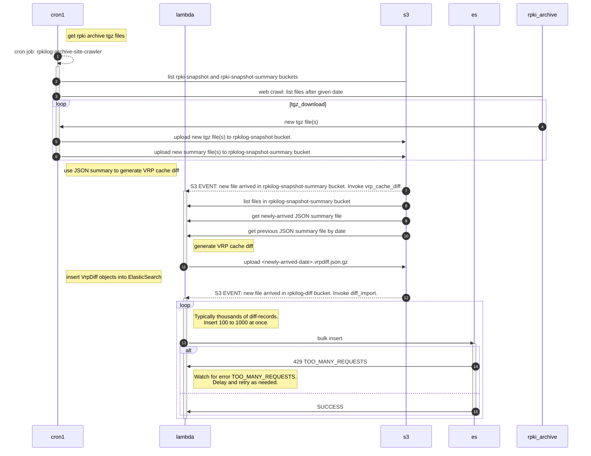

rpkilog.com is a work in progress.

TODO: insert ref to pipeline.mmd here

# Data ingest from RPKI system

A cron job, two lambda functions, and two S3 buckets are involved in the data ingest process.




### Installing from github

```bash
pip3 install --upgrade "git+https://github.com/jeffsw/rpkilog.git#subdirectory=python/rpkilog"
```

### Lucene query example

Lucene syntax is unforgiving in that the database generally won't give you an error message when executing
a query with many kinds of malformations.  For example, `maxLength:>=24` requires that `:` after the field
name, but if omitted, the database is likely to silently match zero records.

```lucene
prefix:"192.0.2.5" AND maxLength:>=24
```
