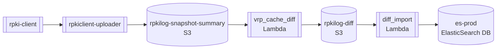

[rpkilog.com](https://rpkilog.com) is a searchable database of RPKI add/update/delete events.  rpkilog is developed and operated by [Jeff Wheeler](https://github.com/jeffsw/).  It is typically current to within the last 10 minutes, and has data dating back to 2021-SEP (courtesy of [Job Snijders](https://github.com/job/)).

All rpkilog source code is contained in this repo, including all the Terraform necessary to instantiate the AWS and Linode resources for hosting it, as well as related on-prem lab resources for its dev environment.  Contributions welcome!

# Data ingest from RPKI system

rpkilog runs [rpki-client](https://www.rpki-client.org/) on a [Linode](https://www.linode.com/) VM (production; home network for dev).

Our `rpkiclient-uploader` cron job checks for a new VRP snapshot, which rpki-client typically produces every 10 minutes.  It uploads these to the AWS S3 bucket `rpkilog-snapshot-summary`.

S3 triggers `rpkilog-vrp-cache-differ` comparing the new snapshot to the previous one, producing a vrp diff file.  The diff file is uploaded to the `rpkilog-diff` bucket.

S3 triggers another lambda `rpkilog-ingest-tar` (the name could use updating 😎) which inserts add/update/delete records from the diff into OpenSearch.

Both the snapshot-summaries and diffs are retained in S3 so we can easily reprocess data in the future.


```mermaid
flowchart LR
    rpki_client[[rpki-client]]
    rpkiclient_uploader[[rpkiclient-uploader]]    
    s3_snapshot_summary[(rpkilog-snapshot-summary\nS3)]
    vrp_cache_diff[[vrp_cache_diff\nLambda]]
    s3_diff[(rpkilog-diff\nS3)]
    diff_import[[diff_import\nLambda]]
    elasticsearch[(es-prod\nElasticSearch DB)]

    rpki_client --> rpkiclient_uploader
    rpkiclient_uploader --> s3_snapshot_summary
    s3_snapshot_summary --> vrp_cache_diff
    vrp_cache_diff --> s3_diff
    s3_diff --> diff_import
    diff_import --> elasticsearch
```

### Installing from github

```bash
pip3 install --upgrade "git+https://github.com/jeffsw/rpkilog.git#subdirectory=python/rpkilog"
```

# ElasticSearch query examples

> ⚡ For users who would like to query the ElasticSearch database directly instead of via the https://rpkilog.com
web site or HTTP API, some examples will be provided here.

### Lucene syntax

Lucene syntax is unforgiving in that the database generally won't give you an error message when executing
a query with many kinds of malformations.  For example, `maxLength:>=24` requires that `:` after the field
name, but if omitted, the database is likely to silently match zero records.

```lucene
prefix:"192.0.2.5" AND maxLength:>=24
```
