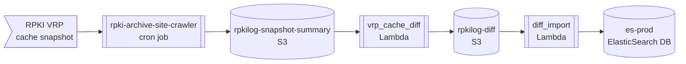

[rpkilog.com](https://rpkilog.com) is a work in progress, but you can query it today for real data.  All
source code is contained in this repo, including all the Terraform necessary to instantiate the AWS resources
for hosting it.  Contributions welcome!

# Data ingest from RPKI system

We check for updated VRP cache snapshots every 10 minutes.  When one is found, the VRP summary we need
is extracted and uploaded to the `rpkilog-snapshot-summary` bucket.  From then, an event-driven pipeline
processes the data using two Lambda functions, and inserts it into ElasticSearch.

Both the snapshot-summaries and diffs are retained in S3 so we can easily reprocess data in the future.




### Installing from github

```bash
pip3 install --upgrade "git+https://github.com/jeffsw/rpkilog.git#subdirectory=python/rpkilog"
```

# ElasticSearch query examples

> ⚡ For users who would like to query the ElasticSearch database directly instead of via the https://rpkilog.com
web site or HTTP API, some examples will be provided here.

### Lucene syntax

Lucene syntax is unforgiving in that the database generally won't give you an error message when executing
a query with many kinds of malformations.  For example, `maxLength:>=24` requires that `:` after the field
name, but if omitted, the database is likely to silently match zero records.

```lucene
prefix:"192.0.2.5" AND maxLength:>=24
```
