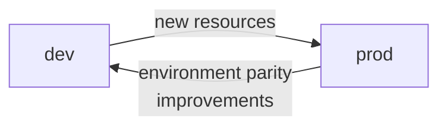

# rpkilog terraform/ README

rpkilog is a weekend project with no development environment, CI pipeline, etc. This has
proven to be a limitation for features development (as always). However, I don't want to stand up a
duplicate of the current production and iterate from there, in part because of cost (AWS is expensive).

## path locations

| path              | description                    |
|-------------------|--------------------------------|
| /                 | current production root module |
| terraform/root    | future root module(s)          |
| terraform/modules | reusable modules               |

## workspaces

| root module        | workspace | description                          |
|--------------------|-----------|--------------------------------------|
| /                  | default   | current production, and nothing else |
| terraform/root/dev | dev       | new dev resources                    |

## promotion plan

