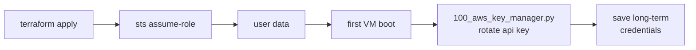

# aws_iam_user_for_vm Terraform module

This module manages an IAM Role `<name>_key_manager` and an IAM User `<name>`.  The user's
API key is rotated upon the VM's first boot-up using a ephemeral STS token for the *key_manager* role,
which may be embedded in plaintext user-data with less risk in case the user-data is compromised or
exposed in Terraform state.  The STS token validity can be as short as 15 minutes (AWS limitation).



## External Dependencies

* awscli
* jq

The machine running `terraform apply` must have [`awscli`](https://aws.amazon.com/cli/) and [`jq`](https://jqlang.org/) installed. During apply this module shells out to `aws sts assume-role` and pipes the result through `jq` to extract credentials; Terraform will not detect these tools as missing until it attempts to create the STS token.

## Arguments

See the module source for most argument information.

⚠️ Warning: If Terraform is already running under an assumed role, the limit to `sts_token_duration` is 3600 seconds,
due to AWS API duration limitation on _role chaining_.

## Outputs

`key_manager` is a flattened merge of `.Credentials` and `.AssumedRoleUser` from `aws sts assume-role` and will look like the following:

```json
{
  "AccessKeyId": "...",
  "SecretAccessKey": "...",
  "SessionToken": "...",
  "Expiration": "...",
  "AssumedRoleId": "...",
  "Arn": "..."
}
```

`user` contains the resulting `aws_iam_user` resource.  Typically, you need to access the `name` attribute like `module.<symbol name>.user.name`.

## Usage

```terraform
module "rpkiclient" {
  source = "module/aws_iam_user_for_vm"
  name   = "rpkiclient_uploader_${terraform.workspace}"
}

resource "incus_instance" "rpkiclient" {
  name  = "rpkiclient"
  type  = "virtual-machine"
  image = "images:ubuntu/24.04/cloud"
  config = {
    "user.user-data" = <<-EOT
        #cloud-config
        users:
          - name: rpkilog
        write_files:
          - path: /root/.aws/config
            owner: root:root
            permissions: '0600'
            content: |4
                [default]
                aws_access_key_id = ${module.rpkiclient.key_manager.AccessKeyId}
                aws_secret_access_key = ${module.rpkiclient.key_manager.SecretAccessKey}
                aws_session_token = ${module.rpkiclient.key_manager.SessionToken}
          - path: /var/lib/cloud/scripts/per-once/100_aws_key_manager_wrapper.sh
            defer: true
            permissions: '0755'
            content: |4
                #!/bin/bash -e
                /usr/local/bin/100_aws_key_manager.py \
                    --username ${module.rpkiclient.user.name} \
                    --cred-file-path /home/rpkilog/.aws/credentials \
                    --cred-file-owner rpkilog \
                    --cred-file-group rpkilog
    EOT
  }
}
```

When the VM boots up for the first time, it uses the `key_manager` user to rotate the AWS IAM API key
on the `<name>` user.  As long as this happens before the STS token expires, everything is fine.

The `<name>` user's long-term API key is then saved on the VM.  Only the VM knows the API key; it's not
saved in the Terraform state.